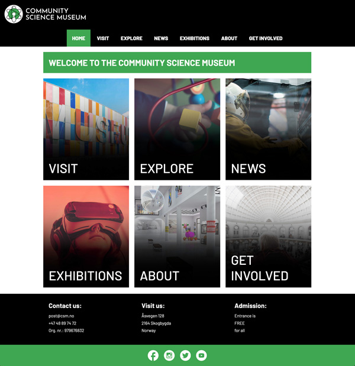

# Semester Project - CSMuseum-LotteAH



## Description

The Community Science Museume page is a website containing information about the museum

Featuers:

- Opening hours
- Ticket information
- Exhibitions

## Built With

- HTML
- CSS

### Installing

1. Clone the repo:

```bash
git clone https://github.com/LotteAH/CSMuseum-LotteAH.git
```

### Running

Open the file in Live server

## Contact

lotteaasha@hotmail.com

## License

[License](LICENSE)
